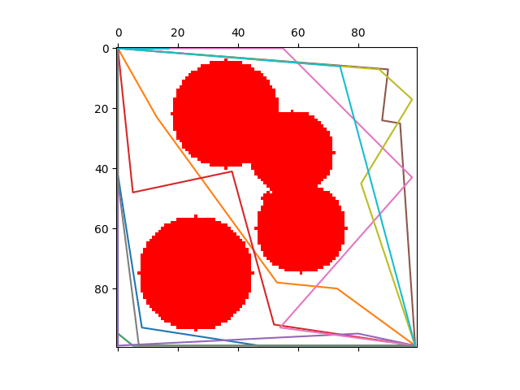
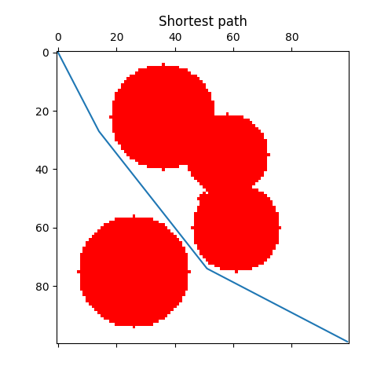
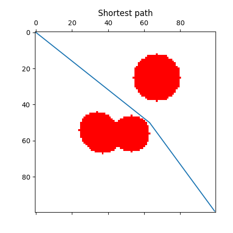
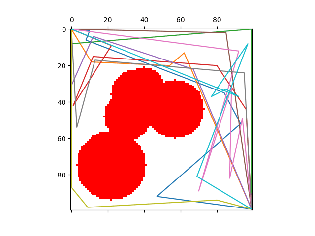
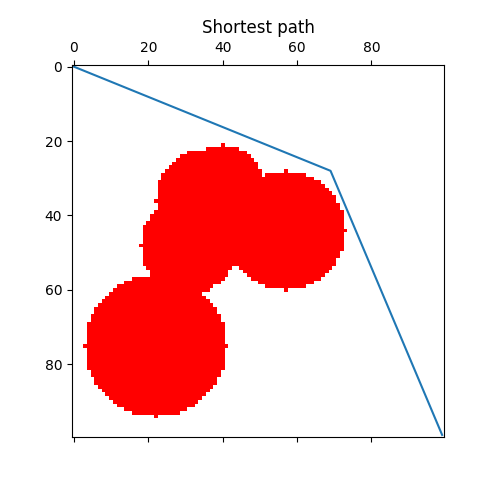
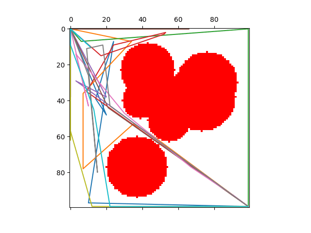
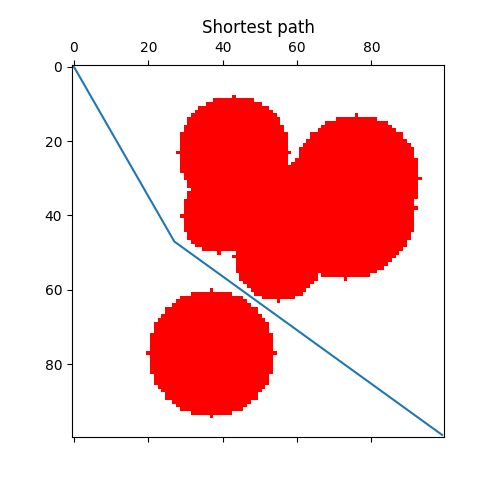
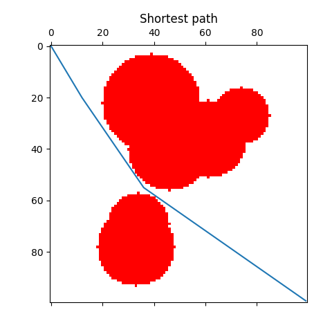

**PATH PLANNER USING PARTICLE SWARM OPTIMIZATION**

Simple Particle Swarm Optimization applied to the task of path planning.
The goal is to find the shortest path between two points in a map with some obstacles.
A path represents a particle in the PSO algorithm. A customizable number of consecutive checkpoints describes every path. Every path is made by the segments between those checkpoints, the starting point and the goal.

The Particle Swarm Optimization has been improved adding some randomization and adaptiveness to the inertia weight.
Random values are assigned to the velocities of the particles at a fixed interval and if the global best values doesn't improve after many iterations.
The inertia weight of the particle velocities is initially small and is increased as the iteration number gets bigger.
This strategy helps to favor exploration during the first iterations and exploitation on the last iterations.

The obstacles size and position are generated randomly at every run of the program.

**INSTRUCTIONS**

To test the program run the PSO.py file.
Environment and PSO parameters can be set directly in the code.

**EXAMPLES**

The following exmaples are made using a 100x100 map with 8 obstacles.
The number of particles/paths used is 10 and they are made of 5 checkpoints.

Those shown in the animation are the best paths found by every particle.
The second images shows the final best path found by the algorithm.

*Example number 1:*

*Example number 2:*

*Example number 3:*

*Example number 4:*

*Example number 5:*

